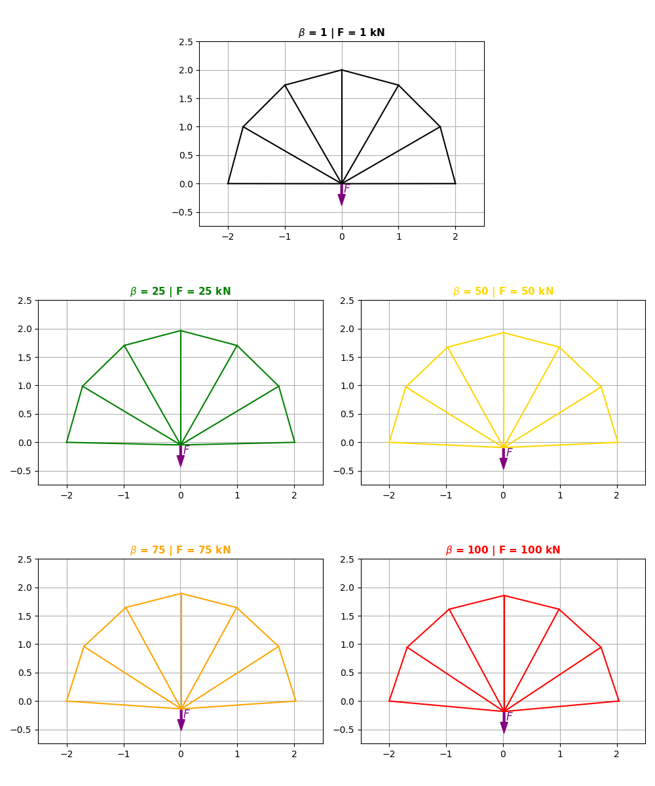

# TrabalhoTrelicasHaveroth

## Como utilizar:

O uso deste projeto é bem simples: basta clonar o repositório na sua máquina e instalar os seguintes pacotes em uma Venv:

- Numpy
- MatPlotLib
- Polars

Para rodar os métodos numéricos, basta rodar a main
`./main.py`
Assim, é possível visualizar os gráficos sobre desempenho dos algoritmos.

Para rodar as animações e visualizações gráficas, basta acessar o arquivo `animacao.ipynb` e seguir as instruções disponíveis no arquivo.

